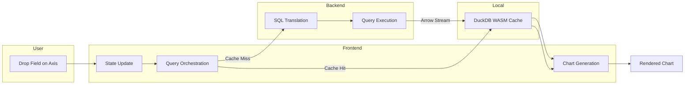
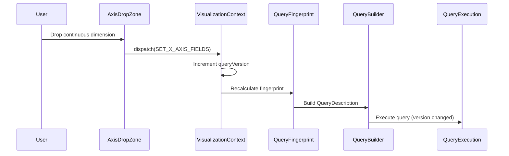
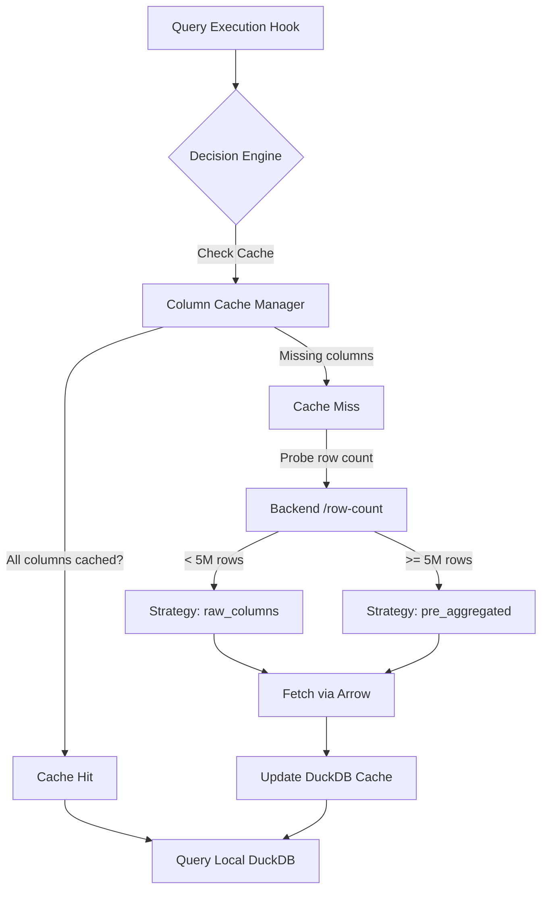
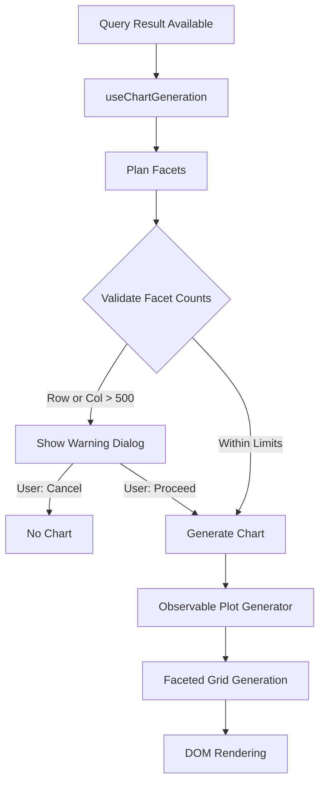

# Axis Field Change Flow: From User Action to Rendered Chart

This document describes the complete flow when a user adds a continuous dimension to an axis, triggering a scatter chart with faceting. The scenario assumes:
- **Connection**: ClickHouse
- **Dataset size**: <5M rows (enables local DuckDB WASM caching)
- **Existing state**: Discrete dimensions already present (triggering faceting)

---

## High-Level Overview



**Summary**: User drops field → State updates (queryVersion increments) → Query decision engine determines strategy → Data fetched/cached → Chart generated with facet validation → Observable Plot renders.

---

## Medium-Level Overview

### Phase 1: State Update & Query Triggering



### Phase 2: Query Strategy Decision



### Phase 3: Chart Generation & Facet Validation



---

## Detailed Level

### 1. User Interaction → State Update

**Entry Point**: User drops a continuous dimension onto an axis drop zone.

**File**: `frontend/src/components/Visualization/AxisDropZone.tsx`

The drop handler dispatches an action to update axis fields:

```
dispatch({ type: 'SET_X_AXIS_FIELDS', payload: [...currentFields, newField] })
```

**File**: `frontend/src/contexts/VisualizationContext/reducers/axisReducer.ts`

The reducer:
1. Checks if fields actually changed (via `sameFieldArray`)
2. If adding a field (not removal-only), **increments `queryVersion`**
3. Returns new state with updated `xAxisFields` and `queryVersion`

This `queryVersion` bump is the trigger for the entire downstream pipeline.

---

### 2. Query Fingerprint & Description Building

**File**: `frontend/src/components/Visualization/ChartArea/hooks/useQueryFingerprint.ts`

The fingerprint hook creates a stable hash of all query-relevant inputs:
- Axis fields (order-preserved)
- Color/size fields
- Filter configurations
- Virtual table/columns

**File**: `frontend/src/components/Visualization/ChartArea/hooks/useQueryBuilder.ts`

The query builder:
1. Tags fields with axis information (`axis: 'x' | 'y'`)
2. Normalizes measure aggregations (adds default `sum` if needed)
3. Includes encoding fields (color, size, labels, tooltips)
4. Constructs a `QueryDescription` object with:
   - `dimensions[]` - all discrete/continuous dimensions
   - `measures[]` - aggregated measures
   - `filters[]` - base + refinement filters
   - `virtual_columns[]` - computed expressions

---

### 3. Query Execution Hook

**File**: `frontend/src/components/Visualization/ChartArea/hooks/useQueryExecution.ts`

This hook watches for `queryVersion` changes:

```typescript
useEffect(() => {
  if (previousVersion === queryVersion) return;
  lastExecutedVersionRef.current = queryVersion;
  executeQuery(queryDescription, false);
}, [queryVersion, queryDescription, ...]);
```

**File**: `frontend/src/components/Visualization/ChartArea/hooks/useQueryExecutor.ts`

The executor:
1. Creates abort controller for cancellation
2. Starts `'query'` loading operation
3. Calls `queryExecutionOrchestrator.execute()`

---

### 4. Query Decision Engine

**File**: `frontend/src/services/queryDecisionEngine.ts`

The decision engine determines the optimal query strategy:

**Step 1: Filter Tier Analysis**
```typescript
const baseFilterHash = filterTierManager.getBaseFilterHash(sourceTable);
const hasBaseFilterChanged = filterTierManager.hasBaseFilterChanged(...);
```

If base filters changed → invalidate cache, force backend query.

**Step 2: Cache Check**
```typescript
const cachedColumns = columnCacheManager.getCachedColumns(
  sourceTable, sourceDatabase, baseFilterHash
);
const missingColumns = requiredColumns.filter(col => !cachedColumns.includes(col));
```

**Step 3: Size-Based Strategy**
- If all columns cached → `cache_hit` (query locally)
- If missing columns and row count < 5M → `raw_columns` (fetch raw, cache locally)
- If row count >= 5M → `pre_aggregated` (backend does aggregation)

---

### 5. Query Orchestration

**File**: `frontend/src/services/queryExecutionOrchestrator.ts`

Based on decision:

**Cache Hit Path**:
```typescript
if (decision.strategy === 'cache_hit') {
  const localSql = localSqlBuilder.buildRefinementQuery(
    cacheHandle.duckdbTableName,
    refinementFilters,
    requiredColumns
  );
  return await duckdbService.query(localSql);
}
```

**Cache Miss Path**:
```typescript
// Fetch from backend via Arrow streaming
const arrowResult = await apiService.executeQueryArrow(fetchQueryDesc, signal);

// Cache the result in DuckDB WASM
await columnCacheManager.cacheColumns(
  arrowResult.arrowTable,
  selectedTable,
  selectedDatabase,
  baseFilterHash,
  requiredColumns
);

// Apply local refinement filters if any
const localSql = localSqlBuilder.buildRefinementQuery(...);
return await duckdbService.query(localSql);
```

---

### 6. Backend Query Processing

**File**: `backend/routers/query.py`

The `/api/v1/data/query-arrow` endpoint:
1. Validates request
2. Calls `QueryExecutionService.execute_arrow()`

**File**: `backend/services/query_execution_service.py`

The execution service:
1. Validates query description
2. Calls `QueryService.translate_to_sql()` to build SQL
3. Executes via ClickHouse connector
4. Returns Apache Arrow IPC stream

**File**: `backend/services/query_service.py`

SQL translation pipeline:
1. `TableContextBuilder` - Creates PyPika table/join context
2. `SelectClauseBuilder` - Builds SELECT with aggregations
3. `FilterBuilder` - Builds WHERE clause from filters
4. `GroupingOrderingBuilder` - Adds GROUP BY / ORDER BY
5. `SamplingAndLimitsBuilder` - Adds sampling/limits
6. `apply_result_budget()` - Wraps with reduction if needed

**File**: `backend/connectors/clickhouse_connector.py`

The connector executes the SQL and returns results.

---

### 7. Local Caching (DuckDB WASM)

**File**: `frontend/src/services/columnCacheManager.ts`

The cache manager:
1. Generates cache key: `{database}_{table}_{filterHash}`
2. Creates DuckDB table from Arrow data
3. Tracks cached columns in index

**File**: `frontend/src/services/duckdbService.ts`

DuckDB WASM operations:
- `registerArrowTable()` - Imports Arrow data
- `query()` - Executes local SQL
- Query refinement filters are applied locally

---

### 8. Chart Generation with Facet Validation

**File**: `frontend/src/components/Visualization/ChartArea/hooks/useChartGeneration.ts`

When query result arrives:

**Step 1: Build Generation Context**
```typescript
const context: ChartGenerationContext = {
  xFields: xAxisFields,
  yFields: yAxisFields,
  colorField, colorScheme, sizeField, ...
  queryResult,
};
```

**Step 2: Plan Facets**

**File**: `frontend/src/observable-plot-generator/faceting/facetPlanner.ts`
```typescript
const facetPlan = planFacets(context);
// Returns: { rowFacetFields: [...], colFacetFields: [...] }
```

**Step 3: Validate Facet Counts**

**File**: `frontend/src/observable-plot-generator/faceting/facetValidation.ts`
```typescript
const validation = validateFacetCounts(context, facetPlan);
if (!validation.isValid) {
  // Show warning dialog, wait for user decision
  setFacetLimitWarning(validation);
  return; // Don't generate yet
}
```

Validation computes cross-product of unique values:
- Multiple fields on same axis: A × B × C
- Excludes bar/tickstrip category field

**Step 4: Generate Chart**

**File**: `frontend/src/observable-plot-generator/observablePlotGenerator.ts`

```typescript
const plotResult = generatePlot(context);
```

The generator:
1. Analyzes fields to determine chart type (scatter, bar, etc.)
2. If faceting applicable → `generateFacetedGrid()`
3. Otherwise → `generateCartesianPlots()`

**File**: `frontend/src/observable-plot-generator/faceting/facetCoordinator.ts`

Facet coordination:
1. Compute facet combinations (row × col)
2. Compute shared domains across all facets
3. For each cell: filter data, call cell generator
4. Assemble grid layout with labels

---

### 9. Rendering

**File**: `frontend/src/components/Visualization/ChartArea/ChartArea.tsx`

When `spec` updates:
1. `useLayoutEffect` sets up rendering batch tracking
2. `ChartRenderer` receives the plot spec

**File**: `frontend/src/components/Visualization/ObservablePlot.tsx`

For each plot in the grid:
1. Creates Observable Plot with options
2. Appends to DOM
3. Reports render complete to coordinator

**File**: `frontend/src/hooks/useRenderingCoordinator.ts`

Tracks all plots:
- `startRenderingBatch(plotIds, onComplete)`
- `markPlotRendered(plotId)`
- When all rendered → `completeOperation('rendering')`

---

## Key Files Reference

| Layer | File | Purpose |
|-------|------|---------|
| **State** | `contexts/VisualizationContext/reducers/axisReducer.ts` | Axis field state updates |
| **Query Build** | `hooks/useQueryBuilder.ts` | QueryDescription construction |
| **Decision** | `services/queryDecisionEngine.ts` | Cache hit/miss, strategy |
| **Orchestration** | `services/queryExecutionOrchestrator.ts` | Coordinates fetch/cache/local |
| **Cache** | `services/columnCacheManager.ts` | DuckDB cache management |
| **Local SQL** | `services/localSqlBuilder.ts` | DuckDB query construction |
| **Backend Query** | `backend/services/query_service.py` | SQL translation |
| **Backend Exec** | `backend/services/query_execution_service.py` | Query execution |
| **Facet Plan** | `faceting/facetPlanner.ts` | Determines facet fields |
| **Facet Validate** | `faceting/facetValidation.ts` | Checks facet limits |
| **Facet Coord** | `faceting/facetCoordinator.ts` | Orchestrates facet grid |
| **Chart Gen** | `observablePlotGenerator.ts` | Main entry point |
| **Rendering** | `ObservablePlot.tsx` | DOM rendering |

---

## Performance Considerations

1. **Query Fingerprinting**: Prevents duplicate queries when unrelated state changes
2. **Local Caching**: <5M rows cached in DuckDB WASM for instant refinement filtering
3. **Arrow Transport**: Efficient binary format for backend→frontend data transfer
4. **Facet Validation**: Blocks potentially browser-killing >500 facet renders
5. **Rendering Batching**: Coordinates multiple plot renders with loading states
