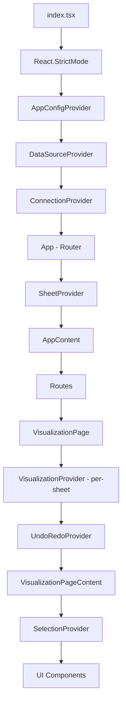
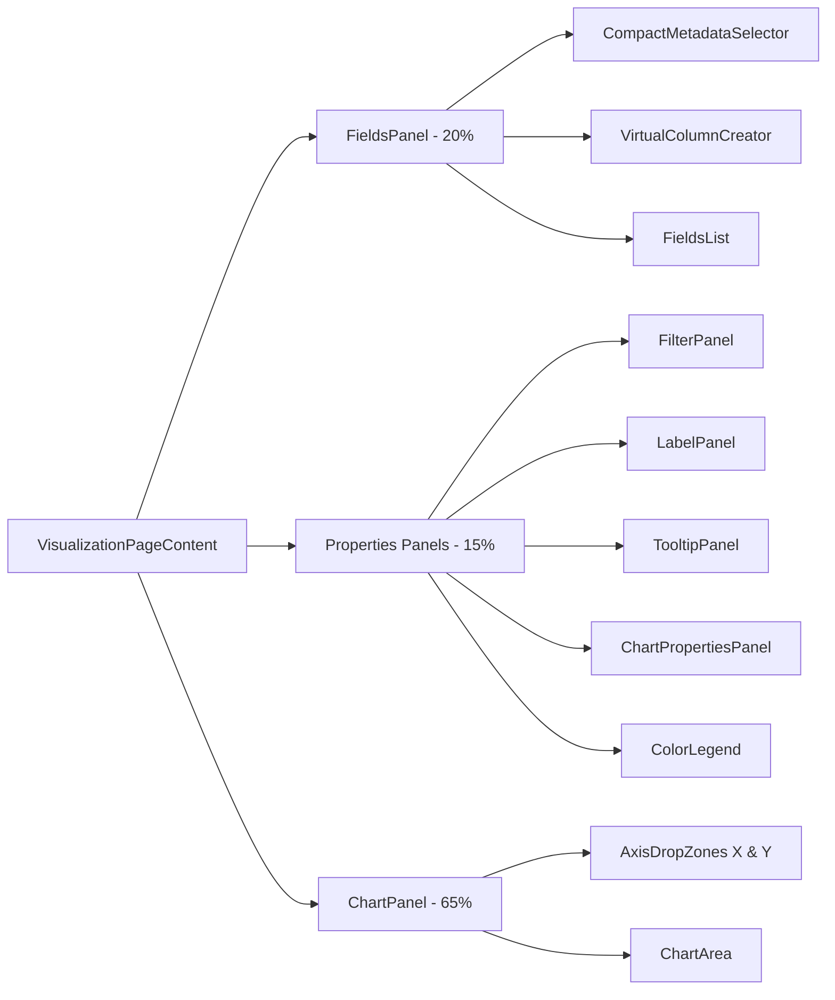
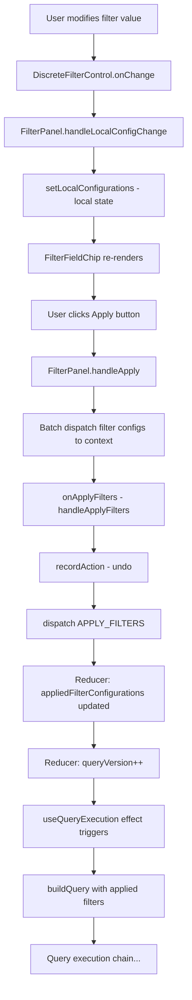
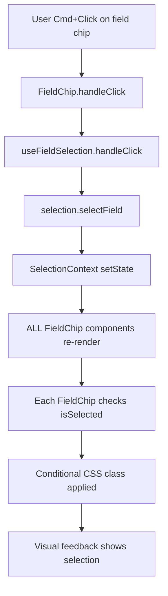
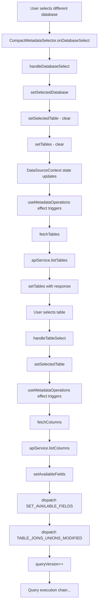

# Frontend UI Management

Documentation of the frontend UI rendering architecture, including component hierarchy, state management, props flow, and re-render mechanics.

**Last Updated**: December 15, 2025

## Overview

This document focuses on the **UI rendering mechanics** of the application - how components are structured, how state flows through the system, and what triggers re-renders. For business logic like field classification, chart type selection, and Observable Plot generation, see the other frontend documentation files.

**Key Questions Answered:**
- Which components render which other components?
- Where does state live and how is it accessed?
- What user actions trigger what re-renders?
- How do events propagate through the component tree?

## Component Hierarchy

### Provider Nesting Structure

The application uses a multi-layered context provider architecture:



**Provider Responsibilities:**
- **Global Level** (App-wide): `AppConfigProvider`, `DataSourceProvider`, `ConnectionProvider`, `SheetProvider`
- **Page Level** (Per-sheet): `VisualizationProvider`, `UndoRedoProvider`
- ConnectionProvider signals query-state reset to the active per-sheet `VisualizationProvider` via `services/resetBus.ts` (no outer Visualization provider required).
- **Component Level**: `SelectionProvider`, `RenderingContext`

### Main Page Structure

**VisualizationPage** is the top-level container that:
- Creates a new `VisualizationProvider` instance per sheet
- Initializes with sheet-specific state from `SheetContext`
- Uses `activeSheetId` as React key to force remount on sheet switch
- Wraps content with `UndoRedoProvider` for undo/redo functionality

**VisualizationPageContent** manages the layout using `react-resizable-panels`:



### Control Components

**FieldsPanel** contains:
- `CompactMetadataSelector` - Database/table picker
- `VirtualColumnCreator` - Calculated column interface
- `FieldsList` - Dimensions and Measures with search
- Drop zone for removing fields from axes
- Memoized with custom comparison function

**Properties Panels** (stacked vertically in middle column):
- `FilterPanel` - Filter configuration with staging and Apply button
- `LabelPanel` - Label field configuration
- `TooltipPanel` - Tooltip field selection
- `ChartPropertiesPanel` - Per-field chart type overrides and global settings
- `ColorLegend` - Displays when colorField is set

**ChartPanel** contains:
- Two `DropZone` components (X and Y axes)
- `ChartArea` for visualization rendering
- Manages keyboard shortcuts (Escape to clear selection)

### Chart Rendering Components

**ChartArea** is the orchestrator that:
- Uses specialized hooks (`useQueryExecution`, `useChartGeneration`, `useRenderingCoordinator`)
- Contains `ChartControls` (swap axis, undo/redo, fullscreen, debug buttons)
- Contains `ChartRenderer` (delegates to `ChartGrid` or `TableView`)
- Contains `DebugInfo` (collapsible debug panel)

**ChartRenderer** conditionally renders:
- `TableView` when `useTableView = true`
- `ChartGrid` for chart visualization
- `BarSortingOverlay` for bar chart sorting

**ChartGrid** handles:
- Single chart or faceted grid rendering
- Uses `useFacetedLayout` for layout calculations
- Three-layer scrolling architecture for faceted charts
- Memoized with spec and data comparison

**ObservablePlot** wraps Observable Plot library:
- `ResizeObserver` for responsive sizing
- Custom tooltip rendering via React Portal
- Fullscreen mode detection
- Render completion callbacks for loading coordination
- Memoized with custom comparison

### Layout Components

**AppLayout** structure:
- Bottom tab bar with sheet navigation (`SheetTabs` component)
- `ConfigurationManager` for configuration persistence
- `LoadConfigurationDialog` for loading saved states
- Context menus and dialogs for sheet management

## State Management

### Context Providers

#### ConnectionContext

**Manages:**
- Connection state: `isConnected`, `isConnecting`, `connectionError`, `connectionDetails`
- Current connection configuration
- Methods: `connect()`, `disconnect()`

**Key Behaviors:**
- Disconnects before establishing new connection
- Clears VisualizationContext state on connect/disconnect
- Does NOT clear axis fields on disconnect (preserves field arrangement)

#### DataSourceContext

**Manages (shared across all sheets):**
- `databases`, `tables`
- `availableFields` - Fields from selected table
- `selectedDatabase`, `selectedTable`, `dataSource`
- Metadata loading states
- Multi-table: `joinConfigurations`, `unionConfigurations`, `tableAliases`
- `cachedTablesByDatabase`, `primaryDatabase`

**Key Behaviors:**
- Resets multi-table state when primary table changes
- Caches tables by database for cross-database unions
- Provides metadata for all sheets

#### SheetContext

**Manages:**
- `sheets` - All workbook sheets array
- `activeSheetId`
- `nextSheetNumber`

**Sheet Structure:**
- Sheet ID and name
- Visualization state snapshot
- Creation and modification timestamps

**Key Behaviors:**
- Creates new sheets with empty visualization state
- Stores sheet state snapshots (NOT including data source selection)
- Persists to localStorage

#### VisualizationContext

**Manages (per-sheet state):**

**Axis Fields:**
- `xAxisFields`, `yAxisFields`
- `availableFields` (computed from DataSource + virtual columns)

**Query State:**
- `queryResult` - Current query data
- `queryError` - Error message if query failed
- `queryVersion` - Increments only on semantic changes

**Loading States:**
- `isLoadingQuery`, `isLoadingRendering`, `isLoadingMetadata`
- `showLoadingModal`
- `activeOperations` - Per-operation tracking
- `modalPrimaryOperation` - Which operation to show in modal
- `operationStartTimes` - Timestamp tracking

**Filter State:**
- `filterFields` - Fields in filter panel
- `filterConfigurations` - Pending filter values (staging area)
- `appliedFilterConfigurations` - Actually used in queries
- `filterMetadata` - Available values, min/max, cardinality

**Encoding State:**
- `colorField`, `colorScheme`, `colorBias`, `manualColor`
- `sizeField`, `sizeRange`, `manualSize`

**Label/Tooltip State:**
- `labelFields`, `labelsEnabled`
- `labelSamplingStrategy`, `labelSamplingThreshold`, `labelSampleEvery`
- `tooltipFields`

**Virtual Columns:**
- `virtualColumns` - Calculated field definitions
- `virtualColumnFieldPreferences` - Type/aggregation overrides

**Chart Overrides:**
- `fieldOverrides` - Per-field chart type and encoding overrides
- `globalChartType` - Overall chart type preference

**Key Behaviors:**
- Reducer-based state management
- `queryVersion` increments only when query semantics change:
  - Adding fields → increment
  - Removing fields → NO increment (data already available)
  - Reordering fields → NO increment (just visual change)
  - Changing field properties → increment
- Operation tracking with timeout-based modal display
- Atomic `MOVE_FIELD_BETWEEN_AXES` action prevents double queries

#### SelectionContext

**Manages:**
- Multi-selection of field chips
- Anchor field for range selection
- Source-specific selection (can't mix sources)

**Methods:**
- `selectField` - Add to selection
- `selectSingle` - Replace selection with single field (uses `flushSync`)
- `deselectField` - Remove from selection
- `toggleSelection` - Cmd/Ctrl+Click behavior
- `selectRange` - Shift+Click behavior
- `clearSelection` - Clear all

#### RenderingContext

**Manages:**
- Rendering batch coordination
- Tracks when all plots in faceted grid complete rendering
- Uses `useRenderingCoordinator` hook

**Key Behaviors:**
- `startRenderingBatch(plotIds, onComplete)`
- Each `ObservablePlot` calls `markPlotRendered(plotId)`
- When all plots rendered → triggers completion callback
- 30-second timeout fallback

#### UndoRedoContext

**Manages:**
- Undo/redo stack (max 50 items)
- Tracks `canUndo`, `canRedo`
- Two-phase operations: `undo()` returns state, `completeUndo()` updates stacks

**Key Behaviors:**
- Uses `skipRecordingRef` to prevent recording undo actions during undo/redo
- Clears history on sheet switch
- Deep clones state to avoid reference issues

#### LayoutContext

**Manages:**
- Panel visibility/collapse state
- Panel sizes
- Layout persistence

### Context Composition Strategy

**Global contexts** provide application-wide state (connection, data source, sheets)

**Per-page contexts** provide page-specific state that resets on navigation (visualization state per sheet)

**Component-scoped contexts** provide localized functionality (selection, rendering coordination)

**State Flow Direction:**
```
ConnectionContext
  ↓ connection details, isConnected
DataSourceContext
  ↓ selectedDatabase, selectedTable, availableFields
SheetContext
  ↓ activeSheet state
VisualizationContext (initialized with activeSheet state)
  ↓ xAxisFields, yAxisFields, filters, etc.
Components (consume via hooks)
```

## Props Flow

### Top-Down Data Flow

**VisualizationPage → FieldsPanel:**
- `availableFields` from `useVisualizationState`
- `selectedDatabase`, `selectedTable` from `DataSourceContext`
- `databases`, `tables` from `DataSourceContext`
- Callback handlers: `onFieldUpdate`, `onDatabaseSelect`, `onTableSelect`
- `virtualColumns`, `onAddVirtualColumn`
- Total: 20+ props

**VisualizationPage → ChartPanel:**
- `xAxisFields`, `yAxisFields`
- Drop handlers: `onXAxisDrop`, `onYAxisDrop`
- Update handlers: `onFieldUpdate`, `onRemoveField`, `onReorderFields`
- `onMoveFieldBetweenAxes`

**ChartPanel → DropZone:**
- `axis` identifier ('x' or 'y')
- `fields` array
- All event handlers from parent

**DropZone → FieldChip:**
- `field` object
- `source` identifier (e.g., 'X_AXIS')
- `onUpdate` callback
- `index` for ordering
- `allFields` array

### Context Consumption Patterns

**Direct Context Access:**
```
// In ChartArea
const { state, dispatch, startOperation, completeOperation } = useVisualizationContext()
const { dataSource } = useDataSource()
const renderingCoordinator = useRenderingCoordinator()
const { recordAction, undo, redo } = useUndoRedo()
```

**Composed Hooks Pattern:**

`useVisualizationState` composes multiple hooks:
- Uses `useVisualizationContext` for core state
- Uses `useDataSource` for data source state
- Uses `useVirtualColumns` for virtual column logic
- Uses `useFieldOperations` for field manipulation
- Uses `useMetadataOperations` for metadata fetching
- Uses `useFilterMetadata` for filter data
- Returns unified interface with all state and handlers

This pattern reduces coupling and simplifies component code.

### Callback Propagation

**Field Update Flow:**
```
User edits field
  ↓
FieldContextMenu.onUpdate
  ↓
FieldsPanel.onFieldUpdate
  ↓
useFieldOperations.handleFieldUpdate
  ↓
dispatch({ type: 'UPDATE_FIELD' })
```

**Field Drop Flow:**
```
User drags field
  ↓
DropZone.onDrop
  ↓
useDragDrop.handleAxisDrop
  ↓
recordAction() (undo)
  ↓
dispatch({ type: 'SET_X_AXIS_FIELDS' })
```

**Filter Apply Flow:**
```
User clicks Apply
  ↓
FilterPanel.onApplyFilters
  ↓
VisualizationPageContent.handleApplyFilters
  ↓
recordAction() (undo)
  ↓
dispatch({ type: 'APPLY_FILTERS' })
```

### Props Drilling vs Context

**Props drilling used for:**
- Callback handlers that need to flow down (onDrop, onUpdate)
- Display data that changes frequently (fields arrays)
- Component-specific configuration

**Context used for:**
- Shared application state accessed across many components
- Cross-cutting concerns (selection state, undo/redo)
- State that needs deep tree access without intermediate components

## Re-render Triggers

### State Change → Component Re-render Map

#### When xAxisFields or yAxisFields change:

**Components that re-render:**
- `VisualizationPageContent` (consumes via `useVisualizationState`)
- `FieldsPanel` (receives as prop, memoized with comparison)
- `ChartPanel` (receives as prop)
- `DropZone` (receives fields as prop, memoized)
- `FieldChip` components (each chip re-renders due to new array reference)
- `ChartArea` (via `useChartGeneration`)
- `ChartRenderer` (receives fields as props, memoized)
- `ChartGrid` (via spec change, memoized)

**Query execution triggered when:**
- `queryVersion` increments (in `useQueryExecution` effect)

#### When filterConfigurations change (user edits filter):

**Does NOT trigger query** (staging area pattern)
- Only `FilterPanel` and `FilterFieldChip` re-render
- Local state in FilterPanel

**When user clicks "Apply":**
- Triggers `APPLY_FILTERS` action
- Updates `appliedFilterConfigurations`
- Increments `queryVersion`
- Query re-executes

#### When queryResult changes:

**Components that re-render:**
- `ChartArea` (consumes state)
- `ChartRenderer` (receives queryResult as prop)
- `ChartGrid` (receives data prop, memoized)
- `TableView` (if in table view mode)
- `FilterFieldChip` components (options change)

#### When selection changes (SelectionContext):

**Components that re-render:**
- ALL `FieldChip` components (consume selection context via `useSelection`)
- `FieldsPanel`, `DropZone` containers don't re-render (memoized)

**Performance Note:** FieldChip is NOT memoized because it needs to react to selection changes. With 50+ fields, this causes noticeable lag.

### useEffect Dependencies

**useQueryExecution** (triggers query):
```
Dependencies: [
  queryVersion,
  connectionDetails,
  currentQueryDescription,
  xAxisFields,
  yAxisFields
]
```

**useChartGeneration** (generates chart spec):
```
Dependencies: [
  xAxisFields,
  yAxisFields,
  colorField,
  sizeField,
  useTableView,
  queryResult,
  queryVersion,
  labelFields,
  labelsEnabled,
  tooltipFields,
  fieldOverrides,
  globalChartType
]
```

**useRenderingCoordinator setup:**

Uses `useLayoutEffect` instead of `useEffect` to run synchronously before child components render, preventing race conditions.

```
Dependencies: [spec, useTableView]
```

### Performance Optimizations

**Memoized Components:**
- `CompactMetadataSelector` - Prevents re-render when options unchanged
- `FieldsPanel` - Compares all props
- `ChartRenderer` - Compares spec and data references
- `ChartGrid` - Complex custom comparison
- `DropZone` - Compares fields and callbacks
- `ObservablePlot` - Custom comparison
- `PlotArea`, `XAxes`, `YAxes` - Grid sub-components
- `FacetLabels` (Top and Left) - Label components

**NOT Memoized:**
- `FieldChip` - Needs to react to selection context
- Most container components - State changes require re-render

**useMemo for Expensive Computations:**

In `ChartArea`:
- `additionalColorFields` - Extract color fields from fieldOverrides
- `additionalSizeFields` - Extract size fields from fieldOverrides

In `FieldsPanel`:
- `filteredDimensions` - Filter and sort available dimension fields
- `filteredMeasures` - Filter and sort available measure fields

**useCallback for Event Handlers:**

Prevents unnecessary child re-renders by stabilizing callback references:
- `handleSwapAxis`
- `handleUndo`, `handleRedo`
- Field manipulation handlers

### Identified Performance Issues

**FieldChip Re-render Storm:**
- Every selection change causes all FieldChips to re-render
- Cause: `useSelection` hook connects each chip to SelectionContext
- Impact: With 50+ fields, noticeable lag on selection changes

**Double Query Execution in Strict Mode:**
- Queries execute twice in development (React 18 Strict Mode)
- Solution: `lastExecutedVersionRef` tracks executed version

**Unnecessary QueryVersion Increments:**
- Removing fields triggered new query even with data already present
- Solution: `isRemovalOnly` check in reducer

## Re-render Chain Diagrams

### Field Added to Axis

```mermaid
graph TD
    A[User drags field to X axis DropZone] --> B[DropZone.handleDrop]
    B --> C[useDragDrop.handleAxisDrop]
    C --> D[recordAction - save undo state]
    D --> E[dispatch SET_X_AXIS_FIELDS]
    E --> F[Reducer: queryVersion++]
    F --> G[Components consuming xAxisFields re-render]
    G --> H[useQueryExecution effect triggers]
    H --> I[buildQuery with new fields]
    I --> J[startOperation - query]
    J --> K[dispatch SET_LOADING_QUERY]
    K --> L[After timeout: show LoadingModal]
    L --> M[apiService.executeQuery]
    M --> N[Backend processes query]
    N --> O[dispatch SET_QUERY_RESULT]
    O --> P[completeOperation - query]
    P --> Q[useChartGeneration triggers]
    Q --> R[generateChartSpec]
    R --> S[startOperation - rendering]
    S --> T[ChartArea, ChartRenderer, ChartGrid re-render]
    T --> U[useLayoutEffect: startRenderingBatch]
    U --> V[ObservablePlot components mount/update]
    V --> W[Plot.plot creates charts]
    W --> X[onRenderComplete for each plot]
    X --> Y[renderingCoordinator.markPlotRendered]
    Y --> Z[All plots complete]
    Z --> AA[completeOperation - rendering]
    AA --> AB[LoadingModal hides]
```



### Filter Applied



### Field Selection Changed



**Note:** All FieldChip components re-render on every selection change. With 50-100 fields, this can be expensive.

### Database Changed



## Event Handlers

### Field Selection

**Single Click (no modifiers):**
```
FieldChip
  ↓
useFieldSelection.handleClick
  ↓
selection.selectSingle(fieldId, source, field)
  ↓
flushSync(() => setState({
  selectedFields: [{ fieldId, source, field }],
  anchorFieldId: fieldId,
  anchorSource: source
}))
```

Uses `flushSync` for immediate visual feedback.

**Cmd/Ctrl+Click:**
```
selection.toggleSelection(fieldId, source, field)
```
Adds to selection or removes if already selected.

**Shift+Click:**
```
selection.selectRange(anchorFieldId, clickedFieldId, source, allFields)
```
Selects all fields between anchor and clicked field.

### Drag and Drop

**Drag Start:**
```
FieldChip.handleDragStart
  ↓
event.dataTransfer.setData('application/json', {
  fields: selectedFields.length > 1 ? selectedFields : [field],
  source: source
})
```

**Drop on Axis:**
```
DropZone.handleDrop
  ↓
Parse dragData
  ↓
onDrop(fields, source, insertIndex)
  ↓
useDragDrop.handleAxisDrop
  ↓
recordAction(getUndoableSnapshot())
  ↓
if (source === 'AVAILABLE_FIELDS') {
  Create copies with new IDs
  dispatch({ type: 'SET_X_AXIS_FIELDS' })
} else {
  Move between axes
  dispatch({ type: 'MOVE_FIELD_BETWEEN_AXES' })
}
```

**Drop on Fields Panel (remove from axis):**
```
FieldsPanel.handleDrop
  ↓
useFieldsPanelDrag.handleDrop
  ↓
onRemoveMultipleFromAxis(fieldIds)
  ↓
useDragDrop.handleRemoveMultipleFromAxis
  ↓
recordAction(getUndoableSnapshot())
  ↓
dispatch({ type: 'SET_X_AXIS_FIELDS', payload: newXFields })
dispatch({ type: 'SET_Y_AXIS_FIELDS', payload: newYFields })
```

### Filter Workflows

**Filter Configuration Change (typing in inputs):**
```
FilterFieldChip
  ↓
DiscreteFilterControl.onChange
  ↓
FilterPanel.handleLocalConfigChange
  ↓
setLocalConfigurations(prev => ({
  ...prev,
  [fieldId]: config
}))
```

No dispatch to context - stays in local state (staging area).

**Apply Filters:**
```
FilterPanel.handleApply
  ↓
Iterate localConfigurations
  ↓
onConfigChange(fieldId, config) - dispatch to context
  ↓
onApplyFilters()
  ↓
VisualizationPageContent.handleApplyFilters
  ↓
recordAction(getUndoableSnapshot())
  ↓
dispatch({ type: 'APPLY_FILTERS' })
  ↓
Reducer: appliedFilterConfigurations = filterConfigurations
Reducer: queryVersion++
```

### Chart Controls

**Swap Axis Button:**
```
ChartControls.onSwapAxis
  ↓
ChartArea.handleSwapAxis
  ↓
recordAction(getUndoableSnapshot())
  ↓
dispatch({ type: 'SWAP_AXIS_FIELDS' })
```

Does NOT increment queryVersion (data already present).

**Undo/Redo:**
```
ChartControls.onUndo
  ↓
ChartArea.handleUndo
  ↓
const previousState = undo()
  ↓
if (previousState) {
  const currentState = getUndoableSnapshot()
  dispatch({ type: 'RESTORE_UNDOABLE_STATE', payload: previousState })
  completeUndo(currentState)
}
```

**Fullscreen Toggle:**
```
ChartControls.onToggleFullscreen
  ↓
useFullscreen.toggleFullscreen
  ↓
document.fullscreenElement ?
  document.exitFullscreen() :
  chartWrapperRef.current.requestFullscreen()
```

### Connection Changes

**Database Select:**
```
CompactMetadataSelector.onDatabaseSelect
  ↓
useFieldOperations.handleDatabaseSelect
  ↓
setSelectedDatabase(database)
setSelectedTable('') - clear table
setTables([])
  ↓
useMetadataOperations effect triggers
  ↓
fetchTables(database)
  ↓
setTables(response.tables)
```

**Table Select:**
```
CompactMetadataSelector.onTableSelect
  ↓
useFieldOperations.handleTableSelect
  ↓
setSelectedTable(table)
  ↓
useMetadataOperations effect triggers
  ↓
fetchColumns(database, table)
  ↓
setAvailableFields(response.fields)
dispatch({ type: 'SET_AVAILABLE_FIELDS' })
dispatch({ type: 'TABLE_JOINS_UNIONS_MODIFIED' })
  ↓
queryVersion++
```

## Architectural Patterns

### Strengths

**Separation of Concerns:**
- Hooks extract complex logic from components
- Clear responsibility boundaries between contexts

**Query Version Optimization:**
- Smart detection of semantic changes
- Avoids unnecessary re-queries when data already available

**Staging Area Pattern:**
- Filter changes staged locally before Apply
- Reduces backend load and gives user control

**Per-Operation Loading States:**
- Tracks individual operations (query, rendering, metadata)
- Shows which operation is slow for better UX

**Memoization Strategy:**
- Heavy components appropriately memoized
- Prevents cascade re-renders in most cases

**Atomic Operations:**
- `MOVE_FIELD_BETWEEN_AXES` prevents double queries
- `flushSync` for immediate selection feedback

### Areas of Concern

**Selection Context Performance:**
- Every FieldChip re-renders on any selection change
- No memoization possible due to context subscription
- Impact: Noticeable with 50+ fields

**Deep Props Drilling:**
- FieldsPanel receives 20+ props
- Makes component interface complex
- Mitigation: Custom hooks compose functionality

**Context Provider Nesting:**
- 7 levels of provider nesting in some paths
- Can impact performance if not careful
- Mitigation: Proper memoization prevents issues

**Loading Modal Complexity:**
- Complex timeout and state management
- Race conditions possible
- Mitigation: Recent fixes with `ENSURE_PRIMARY_OPERATION`
